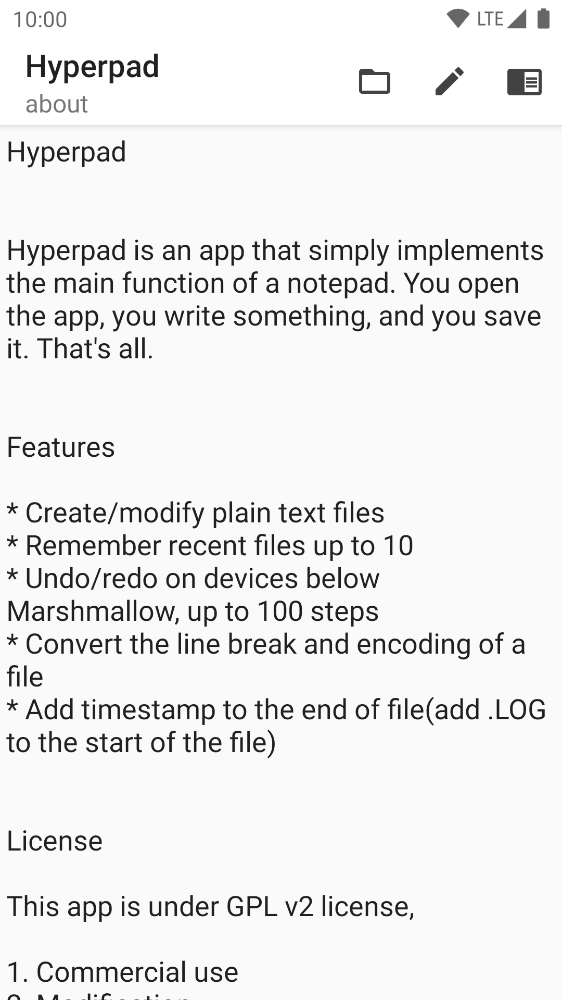
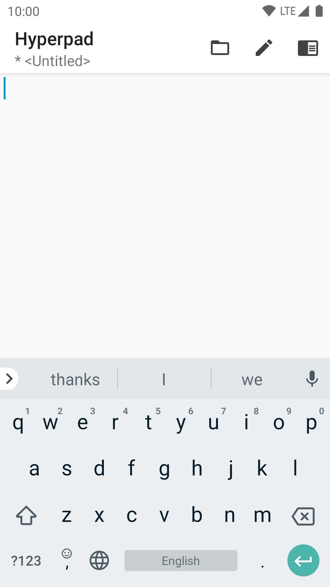

# Hyperpad

&ensp;&ensp;&ensp;&ensp;&ensp;&ensp;&ensp;&ensp;&ensp;

Hyperpad is an app that simply implements the main function of a notepad. You open the app, you write something, and you save it. That's all.

&emsp;&emsp;

### Features

* Create/modify plain text files
* Remember recent files up to 10
* Undo/redo on devices below Marshmallow, up to 100 steps
* Convert the line break and encoding of a file
* Add timestamp to the end of file(add .LOG to the start of the file)

### License

This app is under GPL v2 license,

1. Commercial use
2. Modification
3. Distribution
4. Private use

is permitted UNDER THESE CONDITIONS:

1. Provide this license and copyright notice
2. State changes
3. Disclose source under
4. Same license.

This app uses [unicode-org/icu](https://github.com/unicode-org/icu) to detect the encoding of text files. License files provided with the code.

### Localization

The localization of this app is currently provided by Google Translation. Pull requests are welcomed if you have better localization.

### About us

Thank you for trying donmor's productions. I'd really appreciate it if you kindly support us via the buttons below, and take more effect to improve our productions.

&ensp;&ensp;&ensp;&ensp;

If you take an interest in us, fell free to visit [our homepage](https://donmor.top/).